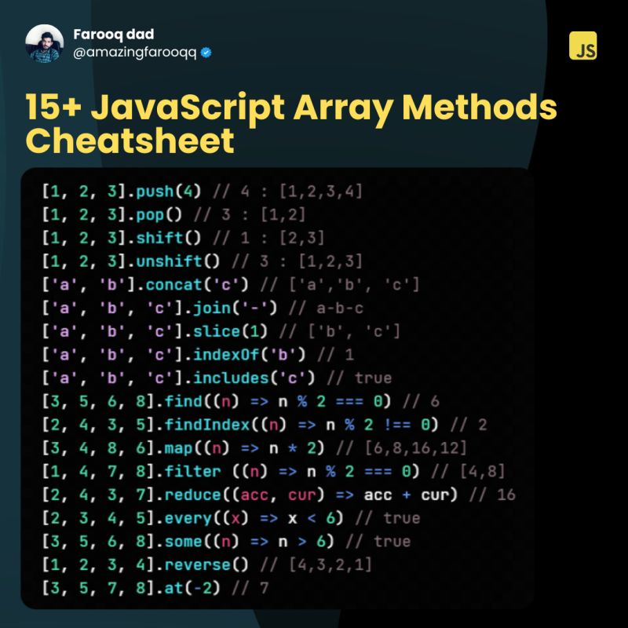

# Cours Markdown

## Formattage du texte

On peut faire  **du gras**, de *l'italique*, et 
<span
style="text-decoration: underline;">blablabla</span>

```html
<html>
    <head>
    </head>


```
Exemple ligne 1.
Toujours ligne 1    // normalde ayni ligne de oluyorlar


> commentaire type

## les liens
[Github](https://github.com)

[Tout en haut](#cours-markdown)

[Autre docs](pwet.md)

## les listes
1. Elem 1
2. elem 2
    1. sous elem 1

- bla
- bla2
    - bla alt




## les tableaux

| Nom de command | Description |
| --- | --- |
| ls | lister les fichier|
|cd|changer direction| 

